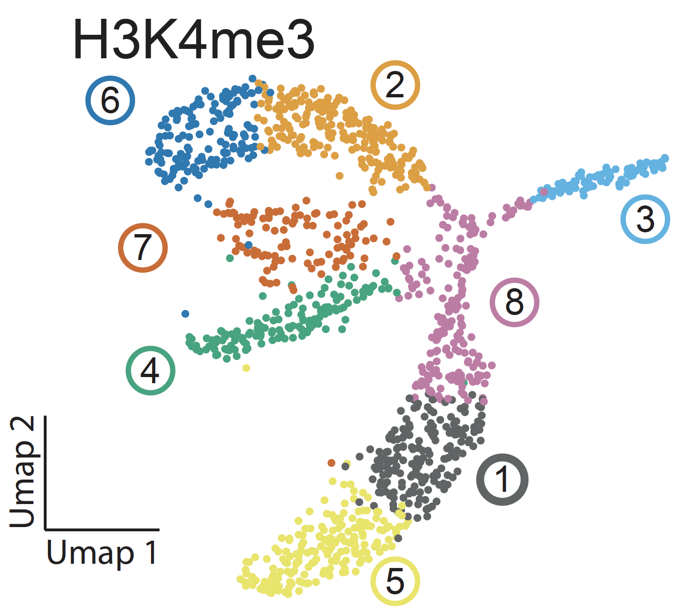

---
Link to files: [](https://doi.org/10.5281/zenodo.3256650)


questions:

    - TODO
    - What are histone modifications?
    - How do we explore the genomic distribution of cuts made by PA-MNase in scChIC-seq? 
    - How do levels in H3K4me3 histone modification differ across cell types in the bone marrow?
    
objectives:

    - TODO
    - Inspect the read quality
    - Trim low quality bases
    - Map reads on a reference genome
    - Assess the quality of a scChIC-seq experiment
    - Extract coverage files
    - Call enriched regions or peaks
    
time_estimation: "3h"

key_points:

    - TODO: Key point 1
    - Key point 2
    - Key point 3
    
contributors:

    - anna-alemany
    - vivekbhr
    - Buys de Barbanson
    - Alexander van Oudenaarden
    - Jake Yeung
    - Peter Zeller
    
software needed:

    - fastqc
    - samtools
    - deeptools
    - bwa
    - hiddenDomains
    - macs2
    - R
    - perl
    - python


# Introduction

Within a cell nucleus, the DNA is tightly-packed and the chromatin is spatially distributed with different levels and scales of organizations. At the smallest scale, DNA is packaged into units called nucleosomes, made of eight histone proteins.


Transcription factors (TFs) in concert with histone modifications shape the chromatin landscape of the genome, and thus regulate cell types and cell states. Histone modifications form an adaptable epigenetic regulatory layer that mediate dynamic transcriptional programs. Functional genomics assays, the most popular involving chromatin immunoprecipitation (ChIP), have revealed active and repressive chromatin structures in bulk tissues. However, inefficiencies of ChIP hinder its application in single cells, preventing genome-wide analysis of histone modifications along the continuum of cellular phenotypes. Therefore, how chromatin landscapes change between repressed, poised, and active states during development and homeostasis is relatively unexplored at the single-cell level.

Binding certain proteins to each of the eight histone proteins may modify the chromatin structure and may result in changes in transcription level. For example, the H3K4me3 is adding 3 methyl-group of the 4th Lysine in the histone 3 amino-acid. This modification is known to activate the transcription on nearby genes by opening the chromatin. The H3K27me3 on the other hand is inactivating the transcription of the nearby genes:


In the upcoming tutorial, we will look at the activator marks H3K4me1 and H3K4me3 scChIC-seq data from mouse bone marrow. We have already performed a dimensionality reduction ([using a method called Latent Dirichlet Allocation](https://en.wikipedia.org/wiki/Latent_Dirichlet_allocation)) on the scChIC-seq in order to cluster cells ([using a method called Louvain community detection](https://en.wikipedia.org/wiki/Louvain_modularity)) with similar histone modification profiles.  This analysis gives us a 2-dimensional summary of the scChIC-seq data: 




We will use this pre-defined clustering to explore scChIC-seq data. We suspect that the differences across cells could be coming from distinct cell types. In this exercise, we will focus on three clusters for each histone mark: for H3K4me1 clusters 11, 2, 5; for H3K4me3 clusters 6, 3, 5. We have already prepared the scChIC-seq data such that the individual cells are grouped into three clusters. Your job is to infer which cluster corresponds to which cell type.

Overview of files provided in this tutorial:

- `fastq_full/demultiplexedR${read}_10000rows.fastq.gz` : demultiplexed `fastq` files for quality control checks before mapping.
- `sorted_bams_filtered/${histone_mark}_cluster_${clstrID}.filtered.bam` : single cell scChIC-seq profiles grouped by clusters. We have already assigned cells to clusters for you, you just have to infer the biological meaning of these clusters (i.e., infer the cell type). We will use these to visualize `bam` files with `IGV`, explore how to calculate number of reads by `MAPQ` quality, and do peak calling.  `bam` files are subset to include only four main regions to reduce file size (defined in `regions/regions_to_filter.txt`).
- `regions/regions_to_filter.txt` : File containing the four genomic regions that contain signal in the `bam` files. 
- `sorted_bigwigs/${histone_mark}_cluster_${clstrID}.bw` : `bigwig` files of scChIC-seq profiles, providing genome-wide coverage of scChIC-seq grouped by their clusters (pseudobulk). We will use `bigwig` files to correlate across pseudobulk samples and visualize the on the `IGV`.
- `chromsizes/chromsizes.${genome}.filt.txt` : size of genomes which are used as input in `hiddenDomains`. 


# Step 1: Quality control and treatment of the sequences

Let's first assess the quality of the demultiplexed `fastq` files. Demultiplexed means UMI and cell barcodes have been clipped from the `fastq` file and placed in the header.

> ### Hands-on: First look at the `fastq` files
> 1. Import `demultiplexedR1_10000rows.fastq.gz` and `demultiplexedR2_10000rows.fastq.gz` from [Zenodo](https://zenodo.org/record/1324070) or from the data library (ask your instructor)
>
>    ```
>    https://zenodo.org/record/3256650/files/demultiplexedR1_10000rows.fastq.gz
>    https://zenodo.org/record/3256650/files/demultiplexedR2_10000rows.fastq.gz
>    ```
>
> 2. Rename the files to `H3K4me3_demultiplexedR1_10000rows.fastq.gz` and `H3K4me3_demultiplexedR2_10000rows.fastq.gz`
>
> 3. Inspect the `fastq` file by using the `less` command
>

During sequencing, errors are introduced, such as incorrect nucleotides being called. These are due to the technical limitations of each sequencing platform. Sequencing errors might bias the analysis and can lead to a misinterpretation of the data.

Sequence quality control is therefore an essential first step in your analysis. We use here similar tools as described in ["Quality control" tutorial]({{site.baseurl}}/topics/sequence-analysis): [FastQC](https://www.bioinformatics.babraham.ac.uk/projects/fastqc/). Interpretation of fastqc outputs can be found here [FastQC Output](http://www.bioinformatics.babraham.ac.uk/projects/fastqc/Help/3%20Analysis%20Modules/).


> ### Hands-on: Quality control
>
> 1. Run **FastQC** on the fastq files
>    - `fastqc H3K4me3_demultiplexedR1_10000rows.fastq.gz` and `fastqc H3K4me3_demultiplexedR2_10000rows.fastq.gz`
> 2. Inspect the generated HTML files
>
>    > ### Questions
>    >
>    > 1. How is the quality of the read 1 and read 2? Why do the lengths of the bases differ? Hint: Remember that the `fastq` files have been demultiplexed.
>    > 2. What are the most common start sequences for the `fastq` files? How does it differ for `R1` and `R2`?
>    > 3. Have the adapters been trimmed in the demultiplexed `fastq` files?
>    >
>    > > ### Solution
>    > > 1. 
>    > > Read 1 per base sequence quality. 65 base pairs because the 3 nt UMI and 8 nt cell barcodes were trimmed.
>    > > 
>    > > Read 2 per base sequence quality. 76 nt long, no UMIs or barcodes in this read. 
>    > > 
>    > > 
>    > > 2. 
>    > > Read 1 per base sequence content. First base is likely coming from Illumina adapters. Second base comes from MNase cuts, which has an affinity for "AA/TT" dinucleotides. 
>    > > 
>    > > Read 2 per base sequence quality (76 nt long, no UMIs or barcodes in this read).
>    > > 
>    > > 
>    > > 3. No.
>    > > 
>    > > Read 2 per base sequence quality (76 nt long, no UMIs or barcodes in this read).
>    > > 
>    > > 


# Step 2: Mapping of the reads

We obtain sequences corresponding to a portion of DNA linked to the histone mark of interest, H3K4me3 in this case. H3K4me3 is associated with active chromatin. It would be interesting to know if there is a difference across cell types.


## Running BWA

> ### Hands-on: Mapping
>
> 1. Run bwa on the fastq files, using an mm10 reference genome.
> TODO Add reference index files into the server.
>
> `bwa mem -t 1 $ref ${f}_R1.fastq.gz ${f}__R2.fastq.gz | samtools view -b - > $outf`
>
> 2. Inspect the mapping stats
>
>    > ### Questions
>    >
>.   > How do you view the aligned reads?
>.   > How do we see the length of each chromosome used in the mapping? Hint: see header in samtools
>    > How many reads where mapped? Uniquely or several times?
>    >

The output of BWA is a BAM file ([binary of Sequence Alignment/Map](https://en.wikipedia.org/wiki/SAM_%28file_format%29)).

## Inspection of a BAM file

Anna TODO Add more things to inspect.


## Correlation between samples

We will compare genome-wide correlation of H3K4me3 and H3K4me1 for different cell clusters.

To compute the correlation between the samples we are going to to use the QC modules of [deepTools](http://deeptools.readthedocs.io/), a software package for the QC, processing and analysis of NGS data. Before computing the correlation a time consuming step is required, which is to compute the read coverage (number of unique reads mapped at a given nucleotide) over a large number of regions from each of the inputed BAM files. For this we will use the tool **multiBamSummary** . Then, we use **plotCorrelation**  from deepTools to compute and visualize the sample correlation. This is a fast process that allows to quickly try different color combinations and outputs.

Since in this tutorial we are interested in assessing H3K4me3 and H3K4me1 scChIC-seq samples. To save time, we have already done that and summarized the scChIC-seq data as bigwig files, which contains the read coverage.

> ### Hands-on: Correlation between samples
>
> 1. Download the read coverage files `bigwig`.
>
> 2. Rename the files
> 3. Compare bigwigs using `multiBigwigSummary`
>    - *"Sample order matters"*: `No`
>       - *"BAM/CRAM file"*: the six imported `bigwig` files
>    - *"Choose computation mode"*: `Bins`
>       - *"Bin size in bp"*: `100000`
>
>
>    Using these parameters, the tool will take bins of 100000 bp. For each bin the overlapping reads in each sample will be computed and stored into a matrix.
>
> 4. **plotCorrelation** with the following parameters
>    - *"Correlation method"*: `Pearson` or `Spearman` (which do you think is more appropriate here? Check by inspecting the scatterplots)
>    - Plot `heatmap` or `scatterplot`.
>    - Plot output in log scale (--log1p) for visualization. 
>
>    

> ### Questions
>
> From the correlation plot, can you infer which clusters correspond to the same cell type in H3K4me1 and H3K4me3?
>
>  ### Solution
>  1.
>  We find high correlation for H3K4me3 cluster 3 with H3K4me1 cluster 2, they may be measuring active histones in the same cell type. H3K4me1 cluster 5 and H3K4me1 cluster 5 also show high correlation, suggesting they may also be the same cell type. 
>  
>  

# Step 4: Exploring `bam` and `bigwig` files on the IGV browser

The `bam` file contains only reads falling in specific genomic regions, in order to reduce the file size. We have clustered single cells into three separate `bam` files, associated with one of three cell types: erythroblast, granulocytes, and B-cells. Your job is to explore which `bam` file is associated with which cell type by looking at cell-type specific regions in the genome browser. 

Cell-type specific regions to look at:

```
chr7    114972165       116898716
chr7    103325741       104425479
chr3    90523036        90870443
chr11   44114099        45269522
```


> ### Questions:
>     1. Can you infer which clusters correspond to which cell types based on the coverage around the four regions?
>

> ### Solution (only `bigwig` shown):
>    1. 
>    H3K4me3_cluster_3 and H3K4me1_cluster_2 have correlated peaks, high in erythroblast-specific regions. 
>    
>    H3K4me3_cluster_5 and H3K4me1_cluster_5 have correlated peaks, high in granulocyte-specific regions.
>    
>    H3K4me3_cluster_6 and H3K4me1_cluster_11 have correlated peaks, high in B-cell-specific regions.
>    


# Step 5: Detecting enriched regions (peak calling)

We could see in the scChIC-seq data some enriched regions that differ across samples. We now would like to call these regions to obtain their coordinates, using `hiddenDomains`. Perhaps the number of peaks predicted in each region across each sample may be clues to what cell type each sample is.

> ###  Hands-on: Peak calling
>
> 1. Calling peaks with `hiddenDomains`
>    > Required inputs:
>    >     -g Size of chromosomes for the mouse genome.
>    >
>    >     -q Minimum MAPQ score. What is an appropriate MAPQ score to use? A low MAPQ score may include reads that are poor quality, while high MAPQ score keeps only high quality reads. Calculate, for each `bam` file, how many reads are assigned at each MAPQ score. Hint: the MAPQ score of each read is found in the fifth column of the bam file. Hint 2: UNIX tools such as `cut` or `awk`, `sort`, `uniq` can do this calculation quickly. 
>    >
>    >     -p A threshold to remove domains called with probabilities less than `p`. Set to a value such as 0.5. You can play around with this value to see how it changes the output.
>    >     -b minimum length. Use the default 1000 bp.
>
>    > ### Questions
>    >
>    > 1. Which type of files were generated? What do they include?
>    > 2. How do the peaks called differ between samples? Can you infer cell types based on this analysis? 
>    > 
>    > ### Solutions
>    >
>    > 1. [See hiddenDomains manual](http://hiddendomains.sourceforge.net)
>    > 2. 
>    >
>    
>    H3K4me3_cluster_3 and H3K4me1_cluster_2 have correlated peaks, high in erythroblast-specific regions. 
>    
>    H3K4me3_cluster_5 and H3K4me1_cluster_5 have correlated peaks, high in granulocyte-specific regions.
>    
>    H3K4me3_cluster_6 and H3K4me1_cluster_11 have correlated peaks, high in B-cell-specific regions.
>    


# Conclusion

We learned to explore `fastq` and `bam` files as well as do calculations on them. We visualized `bam` files and `bigwig` files to see how reads are mapped on the genome. 

